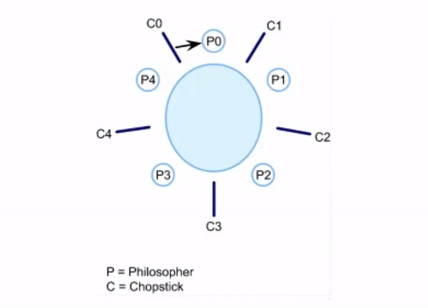

# - Dining Philosopher Problem Using Semaphores

---

## There are 5 philosophers sitting around a round table eating spaghetti and each of them has one chopstick between them. All 5 of them sit around the table and pick up the chopstick placed towards their right. But, here’s the problem. To eat the spaghetti they need both the chopsticks and since everyone picked up the chopstick to their right, nobody gets the left chopstick and hence, nobody can eat.

## Logically thinking, this problem isn’t really a problem in real life scenario. The philosophers could have asked for a few extra pairs of chopsticks, or they could have eaten using their hands 😂 .

## Jokes apart, but the dining philosophers problem is an excellent example to explain the concept of deadlock while resource sharing in OS.

## Consider the philosophers to be processes and the chopsticks to be a shared resource. Every process needs two resources out of which one it has already acquired and the other is acquired by some other process. Till the other process does not free the resource, this process cannot proceed. Similarly, the other process is dependent on another process for its resource. Since every process is dependent on each other, it forms a circular-wait and the system goes into a deadlock condition.

## Here, when each philosopher picks up the chopstick to their right, they also end up picking the left chopstick of the person sitting next to them which leaves every philosopher with just one chopstick and nobody can start eating.

